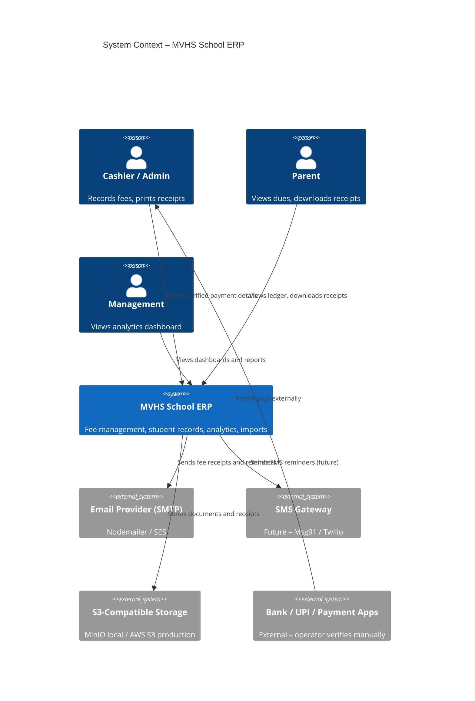
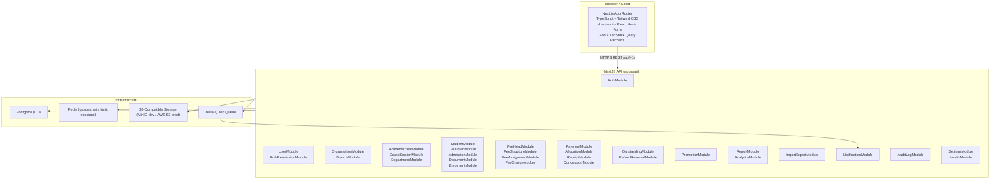
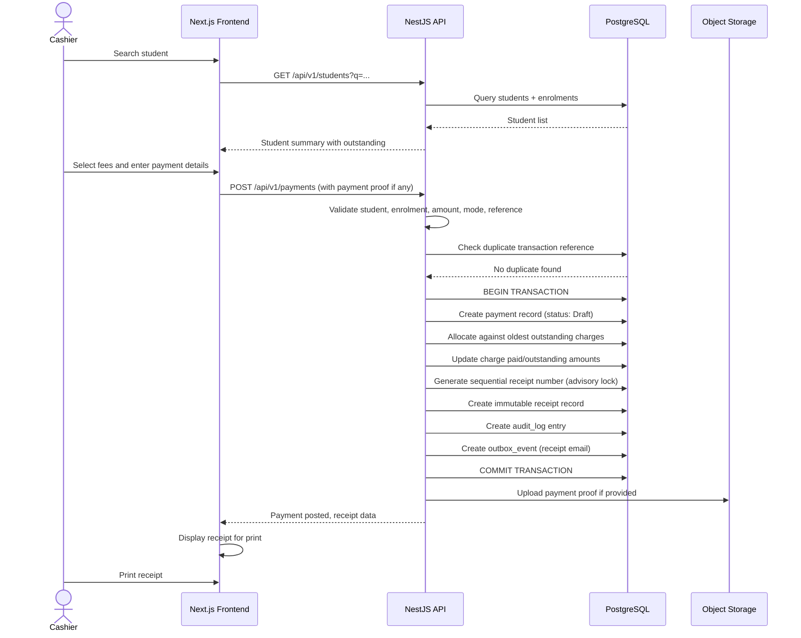
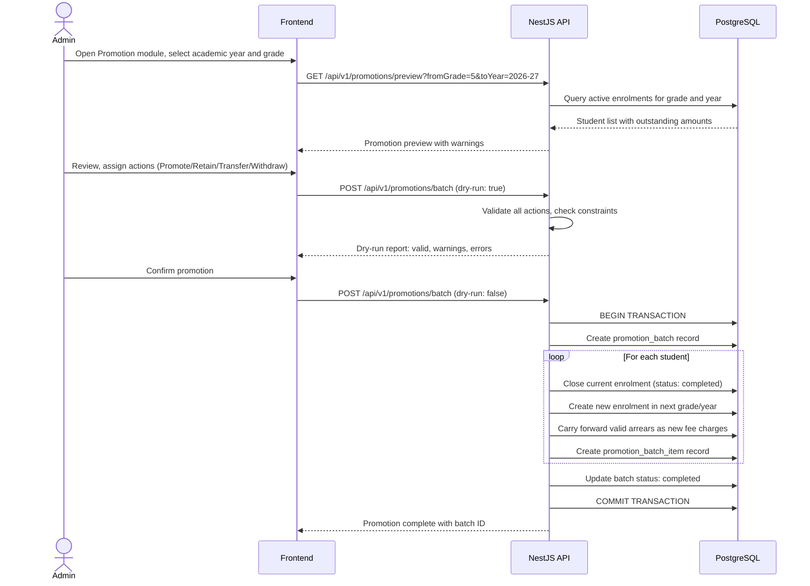
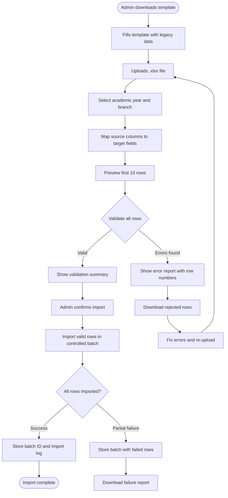

# 03 – Target Architecture
## Marwari Vidyalaya School ERP

> **Status:** Phase 0 – Architecture  
> **Date:** 2026-07-30  
> **Version:** 1.0

---

## 1. Architectural Style

**Modular Monolith** organised as a **Turborepo monorepo**.

The system is a single deployable unit internally structured into domain modules with strict boundaries. This supports:
- Local development simplicity.
- Future extraction of modules to microservices without rewriting core fee logic.
- Single deployment artifact per environment.

---

## 2. System Context Diagram



---

## 3. Application Component Diagram



---

## 4. Repository Structure

```
MVHIGHSCHOOLERP/
├── apps/
│   ├── web/                        # Next.js 15 frontend
│   │   ├── app/                    # App Router pages and layouts
│   │   │   ├── (auth)/             # Login, forgot password
│   │   │   ├── (erp)/              # Authenticated ERP shell
│   │   │   │   ├── dashboard/
│   │   │   │   ├── students/
│   │   │   │   ├── admissions/
│   │   │   │   ├── fee-collection/
│   │   │   │   ├── ledger/
│   │   │   │   ├── outstandings/
│   │   │   │   ├── fee-structures/
│   │   │   │   ├── concessions/
│   │   │   │   ├── promotions/
│   │   │   │   ├── reports/
│   │   │   │   ├── analytics/
│   │   │   │   ├── imports/
│   │   │   │   ├── notifications/
│   │   │   │   ├── masters/
│   │   │   │   ├── users/
│   │   │   │   ├── audit-logs/
│   │   │   │   └── settings/
│   │   ├── components/             # Shared UI components
│   │   ├── lib/                    # API client, utils, hooks
│   │   ├── public/
│   │   ├── next.config.ts
│   │   └── package.json
│   │
│   └── api/                        # NestJS backend
│       ├── src/
│       │   ├── main.ts
│       │   ├── app.module.ts
│       │   ├── modules/            # Domain modules
│       │   │   ├── auth/
│       │   │   ├── users/
│       │   │   ├── roles/
│       │   │   ├── organisations/
│       │   │   ├── branches/
│       │   │   ├── academic-years/
│       │   │   ├── departments/
│       │   │   ├── grades/
│       │   │   ├── sections/
│       │   │   ├── students/
│       │   │   ├── guardians/
│       │   │   ├── admissions/
│       │   │   ├── documents/
│       │   │   ├── enrolments/
│       │   │   ├── fee-heads/
│       │   │   ├── fee-structures/
│       │   │   ├── fee-assignments/
│       │   │   ├── fee-charges/
│       │   │   ├── concessions/
│       │   │   ├── payments/
│       │   │   ├── receipts/
│       │   │   ├── outstandings/
│       │   │   ├── promotions/
│       │   │   ├── reports/
│       │   │   ├── analytics/
│       │   │   ├── imports/
│       │   │   ├── notifications/
│       │   │   ├── audit-logs/
│       │   │   └── settings/
│       │   ├── common/             # Guards, decorators, filters
│       │   ├── prisma/             # Prisma service
│       │   └── config/
│       ├── prisma/
│       │   ├── schema.prisma
│       │   ├── migrations/
│       │   └── seed/
│       └── package.json
│
├── packages/
│   ├── ui/                         # Shared shadcn/ui components
│   ├── shared-types/               # DTOs and type definitions
│   ├── validation/                 # Zod schemas shared between FE and BE
│   ├── config/                     # Shared ESLint, TypeScript configs
│   └── eslint-config/
│
├── docs/                           # Architecture and business documents
├── infrastructure/
│   ├── docker-compose.yml          # PostgreSQL, Redis, MinIO
│   ├── docker-compose.prod.yml
│   └── nginx/
├── scripts/
│   ├── setup-dev.sh
│   └── seed-dev.sh
├── tests/
│   ├── e2e/                        # Playwright tests
│   └── load/
├── .env.example
├── turbo.json
├── package.json
└── README.md
```

---

## 5. Technology Stack

### 5.1 Frontend (apps/web)

| Technology | Version | Purpose |
|-----------|---------|---------|
| Next.js | 15 (App Router) | Framework, SSR, routing |
| TypeScript | 5.x strict | Type safety |
| Tailwind CSS | 4.x | Styling |
| shadcn/ui | latest | Accessible component library |
| React Hook Form | 7.x | Form management |
| Zod | 3.x | Schema validation (shared with BE) |
| TanStack Query | 5.x | Server-state caching |
| Recharts | 2.x | Charts and analytics |
| next-themes | latest | Dark/light mode |
| date-fns-tz | latest | IST timezone handling |
| lucide-react | latest | Icons |

### 5.2 Backend (apps/api)

| Technology | Version | Purpose |
|-----------|---------|---------|
| NestJS | 10.x | Modular framework |
| TypeScript | 5.x strict | Type safety |
| Prisma | 5.x | ORM and migrations |
| PostgreSQL | 16 | Primary database |
| Redis | 7.x | Sessions, rate limiting, queues |
| BullMQ | 5.x | Background jobs |
| Passport.js | latest | Auth strategies |
| argon2 | latest | Password hashing |
| @nestjs/swagger | latest | OpenAPI documentation |
| class-validator | latest | DTO validation |
| class-transformer | latest | DTO serialisation |
| winston | latest | Structured logging |
| helmet | latest | Security headers |
| nestjs-throttler | latest | Rate limiting |
| @aws-sdk/client-s3 | latest | S3 uploads |
| ExcelJS | latest | Excel generation and parsing |
| PDFKit | latest | PDF generation |
| nodemailer | latest | Email |

### 5.3 Infrastructure

| Service | Local Dev | Production |
|---------|-----------|------------|
| Database | PostgreSQL 16 (Docker) | PostgreSQL 16 (managed / VPS) |
| Cache/Queue | Redis 7 (Docker) | Redis 7 (managed / VPS) |
| Object Storage | MinIO (Docker) | AWS S3 or compatible |
| Web Server | Next.js dev server | Nginx + PM2 |

---

## 6. Module Architecture Pattern

Each NestJS module follows a consistent structure:

```
modules/payments/
├── payments.module.ts
├── payments.controller.ts      # REST handlers, permission guards
├── payments.service.ts         # Business logic
├── payments.repository.ts      # Prisma queries
├── dto/
│   ├── create-payment.dto.ts
│   ├── update-payment.dto.ts
│   └── payment-response.dto.ts
├── entities/
│   └── payment.entity.ts
└── payments.spec.ts
```

**Domain events:** The `PaymentPostedEvent` is emitted when a payment posts. `NotificationModule` and `ReceiptModule` subscribe to this event via the NestJS EventEmitter. The `AuditLogModule` subscribes to all mutating events.

**Transactional outbox:** For reliable async notifications, the outbox pattern is used: the notification record is written in the same Prisma transaction as the payment, then a BullMQ job picks it up.

---

## 7. API Standards

All REST endpoints are versioned under `/api/v1/`.

### Success Response
```json
{
  "success": true,
  "data": {},
  "message": "Payment recorded successfully"
}
```

### Error Response
```json
{
  "success": false,
  "code": "PAYMENT_EXCEEDS_OUTSTANDING",
  "message": "The amount exceeds the allowed outstanding balance",
  "details": {}
}
```

### Standard Error Codes

- `STUDENT_NOT_FOUND`
- `ENROLMENT_NOT_FOUND`
- `FEE_STRUCTURE_NOT_ASSIGNED`
- `INVALID_PAYMENT_AMOUNT`
- `PAYMENT_EXCEEDS_OUTSTANDING`
- `DUPLICATE_TRANSACTION_REFERENCE`
- `RECEIPT_ALREADY_VOID`
- `UNAUTHORISED_BRANCH_ACCESS`
- `PROMOTION_ALREADY_COMPLETED`
- `IMPORT_VALIDATION_FAILED`
- `CONCURRENT_PAYMENT_CONFLICT`

---

## 8. Security Architecture

| Layer | Control |
|-------|---------|
| Transport | HTTPS enforced in production |
| Authentication | HTTP-only cookies, SameSite=Strict, short-lived tokens |
| Authorisation | Backend RBAC guard on every endpoint + object-level checks |
| Passwords | Argon2id |
| Sensitive data | Aadhaar encrypted at column level, masked in API responses |
| Input | class-validator DTOs on all inputs |
| Output | class-transformer with excludeExtraneousValues |
| Headers | Helmet (HSTS, CSP, X-Frame-Options, etc.) |
| Rate limiting | nestjs-throttler per IP and per user |
| File upload | Extension whitelist, MIME check, size limit, S3 quarantine |
| Secrets | Environment variables only, never committed to Git |
| Audit | Immutable audit_logs table, never soft-deleted |
| Errors | Generic error message to client; full detail in structured logs only |

---

## 9. Monetary Arithmetic Rules

- All fee amounts are stored in the database as **PostgreSQL `Decimal(15,2)`** type (mapped to Prisma `Decimal`).
- Optionally, amounts can be stored as integer paise (`BigInt` in Prisma) for zero-rounding guarantee.
- **Selected approach:** `Decimal(15,2)` for readability, with all arithmetic done in SQL or via `decimal.js` on the server.
- JavaScript `number` type is **never** used for fee arithmetic.
- All totals are calculated as `SUM()` in PostgreSQL, not in application code.
- Display formatting uses `Intl.NumberFormat('en-IN', { style: 'currency', currency: 'INR' })`.

---

## 10. Fee Collection Sequence Diagram



---

## 11. Student Promotion Sequence Diagram



---

## 12. Excel Migration Flow Diagram



---

*End of Document 03*
