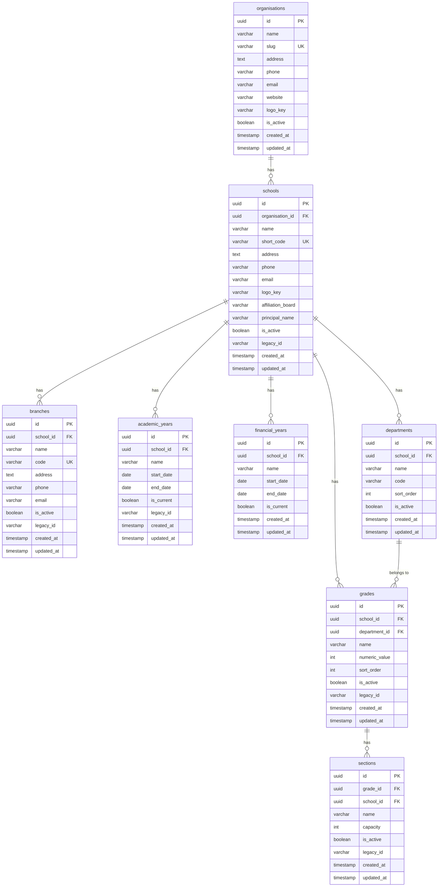
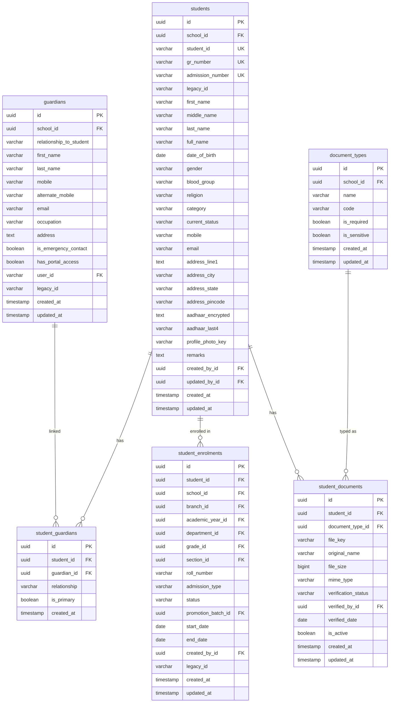
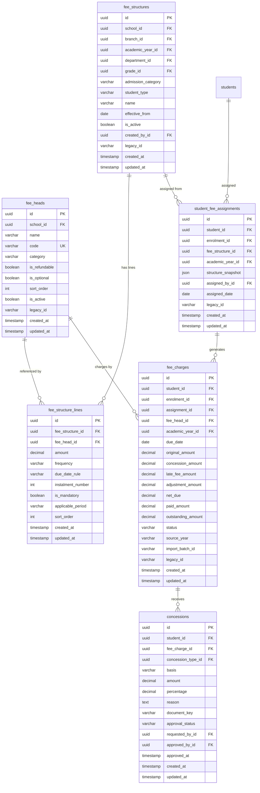
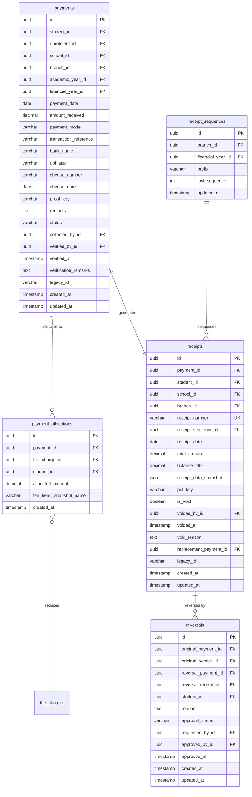
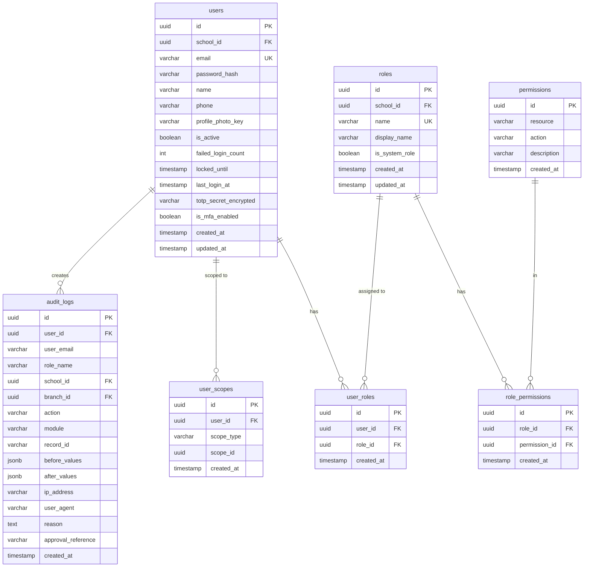
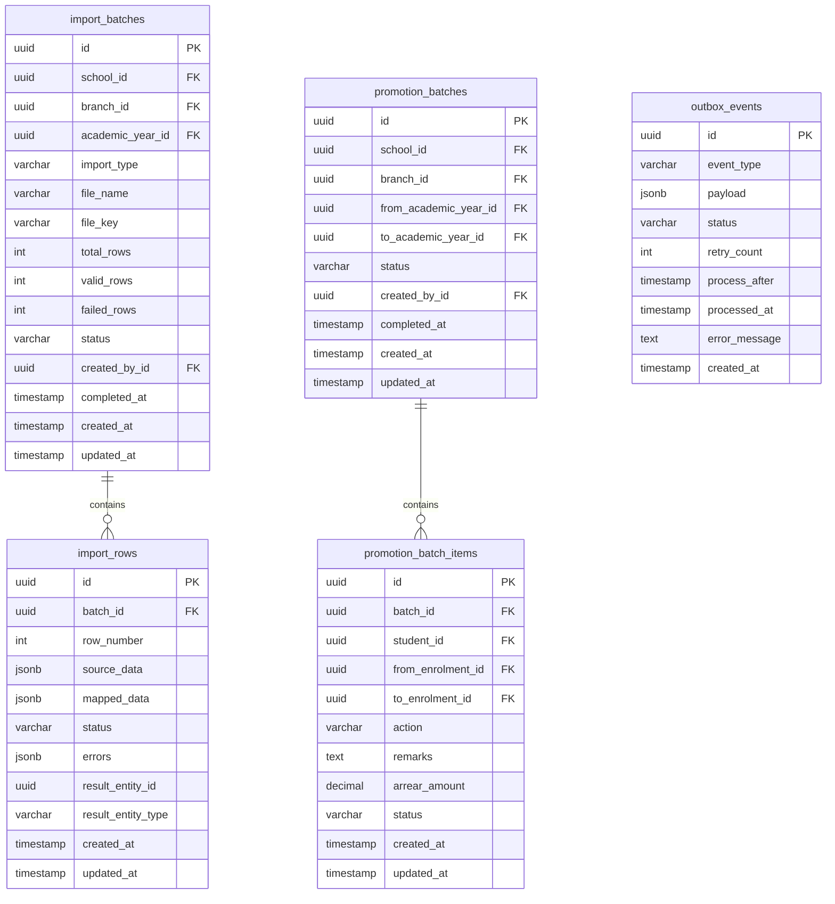

# 04 – Database ERD
## Marwari Vidyalaya School ERP

> **Status:** Phase 0 – Architecture  
> **Date:** 2026-07-30  
> **Database:** PostgreSQL 16

---

## 1. Design Principles

- All primary keys are UUID v4.
- All monetary amounts use `DECIMAL(15,2)` — never `FLOAT` or `REAL`.
- All dates use `TIMESTAMPTZ` (timestamp with time zone) stored in UTC.
- Application layer formats to IST for display.
- Soft deletion is used only where the record must remain referenceable from financial records (e.g., fee heads, grades). Financial records (payments, receipts, audit logs) are never soft-deleted.
- `created_at`, `updated_at`, `created_by_id`, `updated_by_id` on every mutable entity.
- Foreign key constraints enforced at database level.
- `legacy_id VARCHAR(100)` on every entity that will receive migrated data.

---

## 2. Entity Relationship Diagram (Core)



---

## 3. Entity Relationship Diagram (Students and Enrolments)



---

## 4. Entity Relationship Diagram (Fee Engine)



---

## 5. Entity Relationship Diagram (Payments and Receipts)



---

## 6. Entity Relationship Diagram (Users, Roles, Audit)



---

## 7. Entity Relationship Diagram (Imports and Promotion)



---

## 8. Key Database Constraints and Indexes

### Unique Constraints
```sql
-- Receipt number uniqueness
UNIQUE (receipt_number) ON receipts

-- Receipt sequence per branch/financial year
UNIQUE (branch_id, financial_year_id) ON receipt_sequences

-- Duplicate transaction reference prevention
UNIQUE (school_id, payment_mode, transaction_reference) 
  ON payments WHERE payment_mode != 'CASH' AND transaction_reference IS NOT NULL

-- Student unique identifiers
UNIQUE (gr_number) ON students
UNIQUE (admission_number) ON students
UNIQUE (student_id) ON students

-- Fee charge per student per head per period
UNIQUE (enrolment_id, fee_head_id, applicable_period) ON fee_charges

-- Student fee assignment per enrolment
UNIQUE (enrolment_id, fee_structure_id) ON student_fee_assignments

-- One enrolment per student per academic year
UNIQUE (student_id, academic_year_id) ON student_enrolments

-- Academic year per school
UNIQUE (school_id, name) ON academic_years
```

### Critical Indexes
```sql
-- Student search
CREATE INDEX idx_students_gr ON students(gr_number);
CREATE INDEX idx_students_admission ON students(admission_number);
CREATE INDEX idx_students_status ON students(school_id, current_status);
CREATE INDEX idx_students_legacy ON students(legacy_id);

-- Fee charges outstanding lookup
CREATE INDEX idx_fee_charges_outstanding ON fee_charges(enrolment_id, status, due_date);
CREATE INDEX idx_fee_charges_student ON fee_charges(student_id, academic_year_id);

-- Payment lookup
CREATE INDEX idx_payments_student ON payments(student_id, payment_date);
CREATE INDEX idx_payments_status ON payments(school_id, status);
CREATE INDEX idx_payments_txn ON payments(transaction_reference) WHERE transaction_reference IS NOT NULL;

-- Audit log lookup
CREATE INDEX idx_audit_logs_record ON audit_logs(record_id, created_at);
CREATE INDEX idx_audit_logs_user ON audit_logs(user_id, created_at);

-- Receipts
CREATE INDEX idx_receipts_student ON receipts(student_id, receipt_date);
CREATE INDEX idx_receipts_number ON receipts(receipt_number);
```

### Check Constraints
```sql
-- Monetary amounts must not be negative
ALTER TABLE fee_charges ADD CONSTRAINT chk_amounts_positive CHECK (
  original_amount >= 0 AND
  concession_amount >= 0 AND
  late_fee_amount >= 0 AND
  paid_amount >= 0 AND
  outstanding_amount >= 0
);

ALTER TABLE payments ADD CONSTRAINT chk_payment_positive CHECK (amount_received > 0);
ALTER TABLE payment_allocations ADD CONSTRAINT chk_allocation_positive CHECK (allocated_amount > 0);

-- Payment mode validation
ALTER TABLE payments ADD CONSTRAINT chk_payment_mode CHECK (
  payment_mode IN ('CASH','UPI','NEFT','RTGS','IMPS','BANK_TRANSFER','CHEQUE','DD','DEBIT_CARD','CREDIT_CARD','OTHER')
);
```

---

## 9. Table-Level Notes

| Table | Notes |
|-------|-------|
| `audit_logs` | Append-only. No UPDATE or DELETE permissions granted to application role. |
| `receipts` | `is_void` can be set true but the record is never deleted. |
| `payments` | Status transitions: Draft → PendingVerification → Verified → Posted → ChequePending → ChequeCleared/ChequeBounced/Reversed. No DELETE. |
| `fee_charges` | Generated from assignment. Concession reduces net_due. Outstanding = net_due - paid_amount. |
| `student_fee_assignments` | `structure_snapshot` stores the full fee structure JSON at time of assignment. |
| `outbox_events` | Processed by BullMQ worker. Status: PENDING → PROCESSING → DONE / FAILED. |

---

*End of Document 04*
